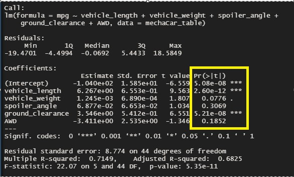

# MechaCar_Statistical_Analysis
Jeremy is approached by upper management about a special project. AutosRUs’ newest prototype, the MechaCar, is suffering from production troubles that are blocking the manufacturing team’s progress. AutosRUs’ upper management has called on Jeremy and the data analytics team to review the production data for insights that may help the manufacturing team.
the data analytics team do the following:

* Perform multiple linear regression analysis to identify which variables in the dataset predict the mpg of MechaCar prototypes[1](#1.-Linear-Regression-to-Predict-MPG)
* Collect summary statistics on the pounds per square inch (PSI) of the suspension coils from the manufacturing lots
* Run t-tests to determine if the manufacturing lots are statistically different from the mean population
* Design a statistical study to compare vehicle performance of the MechaCar vehicles against vehicles from other manufacturers. For each statistical analysis, you’ll write a summary interpretation of the findings.

## 1. Linear Regression to Predict MPG

The [MechaCar_mpg.csv](#MechaCar_mpg.csv) dataset contains mpg test results for 50 prototype MechaCars. The MechaCar prototypes were produced using multiple design specifications to identify ideal vehicle performance. Multiple metrics, such as vehicle length, vehicle weight, spoiler angle, drivetrain, and ground clearance, were collected for each vehicle. Determine a linear model that predicts the mpg of MechaCar prototypes using several variables. 

**Null Hypothesis (Ho):** There is no relation between the variables and mpg.      
**Alternate Hypothesis (H1):** There is close relation between atleast 3 variable and mpg

### Results:
From the results generated by using lm() function to determine correlation between mpg with vehicle length, vehicle weight, spoiler angle, drivetrain, and ground clearance. 
* The value of **R-squared** is **0.7149**. This means there is strong postive correlation with the variables.
* the variable/coefficient that are strongly related are 
    - Intercept
    - Vehicle Length
    - Ground Clearance
* The P-value is way more less that 0.05 , hence we can reject the null Hypothesis and accept the Alternate Hypothesis. 

 

