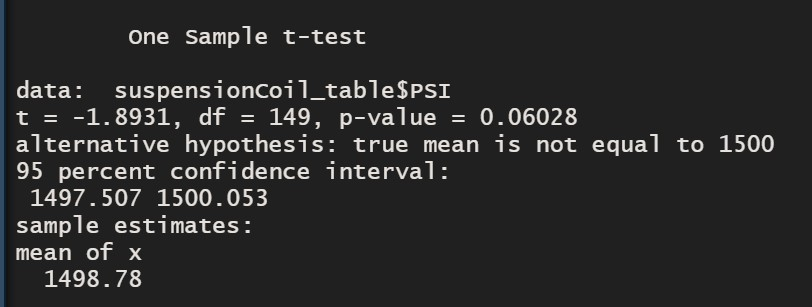
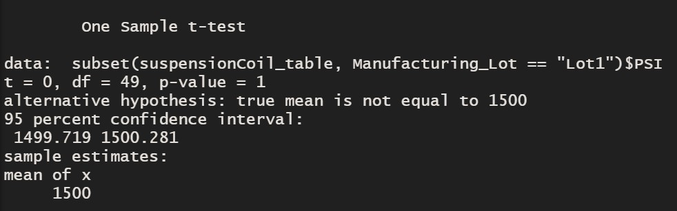
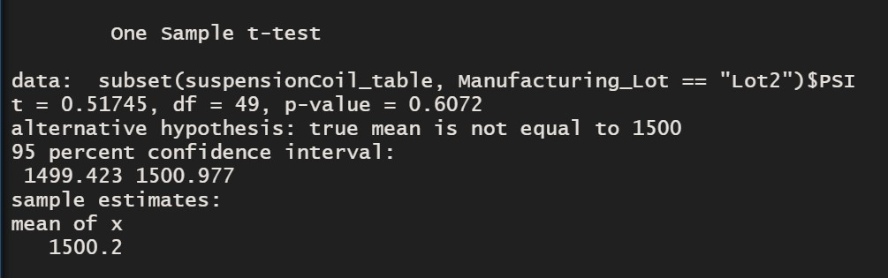

# MechaCar_Statistical_Analysis
Jeremy is approached by upper management about a special project. AutosRUs’ newest prototype, the MechaCar, is suffering from production troubles that are blocking the manufacturing team’s progress. AutosRUs’ upper management has called on Jeremy and the data analytics team to review the production data for insights that may help the manufacturing team.
the data analytics team do the following:

* Perform multiple linear regression analysis to identify which variables in the dataset predict the mpg of MechaCar prototypes [1](#1-Linear-Regression-to-Predict-MPG)
* Collect summary statistics on the pounds per square inch (PSI) of the suspension coils from the manufacturing lots [2](#2-Summary-Statistics-on-Suspension-Coils)
* Run t-tests to determine if the manufacturing lots are statistically different from the mean population [3](#3-T-Tests-on-Suspension-Coils)
* Design a statistical study to compare vehicle performance of the MechaCar vehicles against vehicles from other manufacturers. For each statistical analysis, you’ll write a summary interpretation of the findings. [4](#4-Study-Design--MechaCar-vs-Competition)


## 1 Linear Regression to Predict MPG

The [MechaCar_mpg.csv](#MechaCar_mpg.csv) dataset contains mpg test results for 50 prototype MechaCars. The MechaCar prototypes were produced using multiple design specifications to identify ideal vehicle performance. Multiple metrics, such as vehicle length, vehicle weight, spoiler angle, drivetrain, and ground clearance, were collected for each vehicle. Determine a linear model that predicts the mpg of MechaCar prototypes using several variables. 

**Null Hypothesis (Ho):** There is no relation between the variables and mpg.      
**Alternate Hypothesis (H1):** There is close relation between atleast 3 variable and mpg


### Results:
From the results generated by using lm() function to determine correlation between mpg with vehicle length, vehicle weight, spoiler angle, drivetrain, and ground clearance. 

* the variable/coefficient that are strongly related are 
    - Intercept
    - Vehicle Length
    - Ground Clearance
    
* The P-value is way more less that 0.05 , hence we can reject the null Hypothesis and accept the Alternate Hypothesis. 
  That means the null hypothesis having no relations between vairable and mpg is rejected 
  That concludes slope m is not 0 in the liner regression equation y= mx + b (where m is slope) 
  as based on some value of slope the relation is presented between variables
  
* The value of **R-squared** is **0.7149**. This means there is strong postive correlation with the variables. Roughly 71% of the variablilty of our dependent variable (mpg) is explained using this linear model

<p align="center"> </p>

## 2 Summary Statistics on Suspension Coils
The [MechaCar Suspension_Coil.csv](#Suspension_Coil.csv) dataset contains the results from multiple production lots. In this dataset, the weight capacities of multiple suspension coils were tested to determine if the manufacturing process is consistent across production lots.

### Results:
1) The suspension coil’s PSI continuous variable across all manufacturing lots

<p align="center"> </p>

2) The following PSI metrics for each lot: mean, median, variance, and standard deviation.

<p align="center"> </p>

3) **Summary Statistics on Suspension Coils**
 * The Overall summary ie Total Summary when observed the variance of the PSI is under 100 pounds ie 62.29. Hence we can say the design specifications for the MechaCar suspension coils are met.
 * When we observer the Lot wise Summary, we notice that each lot has difference in meeting the design Specifications.
    - Lot 1 and Lot 2 has minimal variance ie. 0.98 and 7.47 respectively. Which means these lots meet the desing specification and the suspension coil variance is under 100.
    - However, Lot 3 has variance way above 100 ie. it has 170.29. Hence it doesn't meet the design Specifications for the MechaCar suspension Coils.

## 3 T-Tests on Suspension Coils
Determine if there is any statistical difference in mean for different population and different Manufacturing Lots 

**Null Hypothesis (H0):** 
    1) All manufacturing lots - The mean for sample is not statistically different from the population mean of 1,500 pounds per square inch.     
    2) Each lot individually - The mean for Lot is not statistically different from the population mean of 1,500 pounds per square inch.    
**Alternate Hypothesis (H1)** All the individual lot are statistically different from the population mean of 1500 per square inch.

### Various t-Test Results

#### ```Hypothesis 1 - For Total Data```
- T-Test run as below
```R
#Delivery 3:T-Test on Suspension Coils
# 1. Use the t.test() function to determine if the PSI across all manufacturing lots is statistically
# different from the population mean of 1,500 pounds per square inch.
t.test(suspensionCoil_table$PSI,mu=1500)
```
**Result**  
* The **t-value** is **-1.8931** which falls within the range of -2 to +2   
* The **p-value** is **0.06** which is not <0.05
* Mean = 1498.78
    Hence the null hypothesis fails to be rejected. Therefore, All manufacturing lots are statistically not different from the population mean of 1,500 pounds per square inch. 
<p align="center"> </p>

#### ```Hypothesis 2 - For Different Manufacturing Lot```
- T-Test run for Lot 1, Lot2, Lot 3 and respective results
##### i) **Lot 1** 
```R
#For Lot 1
t.test(subset(suspensionCoil_table,Manufacturing_Lot=="Lot1")$PSI,mu = 1500)
```
###### **Result**  
a) The **t-value** is **0** which falls within the range of -2 to +2   
b) The **p-value** is **1** which is not < 0.05  
c) Mean = 1500  
    Hence the null hypothesis fails to be rejected. Therefore, Lot1 is statistically not different from the population mean of 1,500 pounds per square inch. 

<p align="center"> </p>


##### ii) **Lot 2** 
```R
#Lot2
t.test(subset(suspensionCoil_table,Manufacturing_Lot=="Lot2")$PSI,mu = 1500) 
```
###### **Result**  
a) The **t-value** is **0.51745** which falls within the range of -2 to +2   
b) The **p-value** is **0.61** which is not <0.05  
c) Mean = 1500.2
   Hence the null hypothesis fails to be rejected. Therefore, Lot2 are not statistically different from the population mean of 1,500 pounds per square inch. 
   
<p align="center"> </p>

##### iii) **Lot 3** 

```R
#Lot3 
t.test(subset(suspensionCoil_table,Manufacturing_Lot=="Lot3")$PSI,mu = 1500)
```
###### **Result**  
a) The **t-value** is **-2.0916** which does not falls within the range of -2 to +2   
b) The **p-value** is **0.04168** which is **< 0.05**  
c) Mean = 1496.14
   Hence the null hypothesis can be rejected. Therefore, we can say Lot3 are statistically different from the population mean of 1,500 pounds per square inch. 
    
<p align="center"> </p>


## 4 Study Design- MechaCar vs Competition
